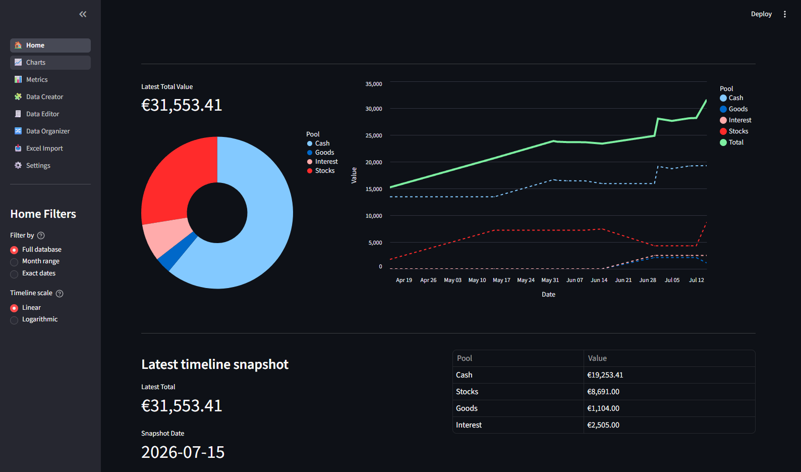

# Finance mosaix

[](https://github.com/Developer-Simon/finance-mosaix/actions/workflows/pytest.yml)
[](https://github.com/Developer-Simon/finance-mosaix/actions/workflows/package.yml)
[](https://github.com/Developer-Simon/finance-mosaix/actions/workflows/pages.yml)
[](https://github.com/Developer-Simon/finance-mosaix/actions/workflows/release-please.yml)
[](LICENSE)
[](https://www.python.org/downloads/)

Finance mosaix is a DuckDB-based personal finance application for importing Excel transaction sheets, tracking cash flow, monitoring assets, and visualizing results with a Streamlit dashboard.



> Disclaimer: this project was mainly realized with CoPilot assistance, using the Raptor mini model for content generation and implementation guidance.

## What it includes

- `src/`: core finance logic, database schema, import and query helpers
- `dashboard/`: Streamlit dashboard UI, charts, and data views
- `test/`: automated tests for import logic and queries
- `docs/`: project-specific documentation and usage guides
- `CONTRIBUTING.md`: contribution guidelines
- `LICENSE`: MIT license

## Naming

- Public brand name: `Finance mosaix`
- Internal code/package name: `FinanceMosaix`
- Project root folder: `finance-mosaix/`
- The virtual environment is created under `finance-mosaix/.venv`.

## Why Finance mosaix?

Finance mosaix is named for the way it brings many finance data pieces together into a single, structured view. It combines budgets, cash flow, assets, reports, and transaction history into one coherent, dynamic picture.

## Quick start

1. Create a Python virtual environment in the project root:

```bash
python -m venv .venv
.\.venv\Scripts\activate
```

2. Install the package and runtime dependencies:

```bash
python -m pip install --upgrade pip
python -m pip install .
```

3. Generate a sample database with realistic data:

```bash
python create_sample_database.py
```

This creates `finance_sample.duckdb` in the current project directory.

4. Start the dashboard:

```bash
python start_dashboard.py
```

5. Open the URL shown by Streamlit to view charts and reports.

## Sample data

The sample database includes:

- checking, savings, and brokerage accounts
- income and expense transactions
- stock portfolio snapshots
- goods depreciation valuations
- interest account balance changes

This dataset is suitable for taking a dashboard screenshot or exploring the app immediately.

## Command-line usage

From the project root:

```bash
python src/finance_cli.py --init
python src/finance_cli.py --import path/to/file.xlsx
python src/finance_cli.py --balance
python src/finance_cli.py --spending 30
python src/finance_cli.py --search "rent"
```

## Docs

More detailed documentation is available in `docs/`:

- [Installation](docs/installation.md)
- [Usage](docs/usage.md)
- [Architecture](docs/architecture.md)
- [CLI Reference](docs/cli.md)
- [Dashboard](docs/dashboard.md)
- [Data Flow](docs/data-flow.md)
- [Sample Data](docs/sample-data.md)

## License

This project is licensed under the MIT License. See `LICENSE` for details.
