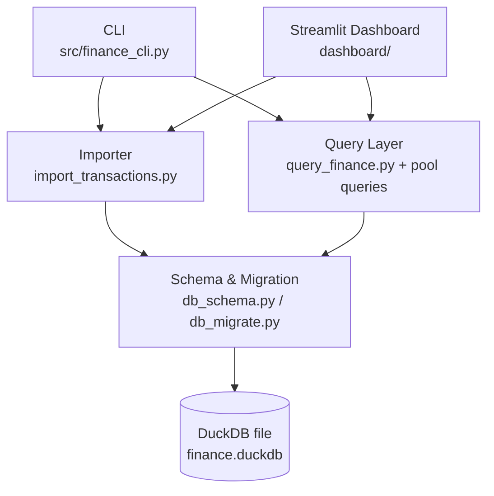

# Architecture

Finance mosaix is structured around a shared DuckDB backend that is used by:

- a CLI surface (`src/finance_cli.py`)
- a Streamlit dashboard surface (`dashboard/app.py`)
- shared query and import helpers in `src/`

The project root is `finance-mosaix/`.

## Architecture Diagram

## Project Layout

- `src/`: database schema, migrations, importer, query layer, and CLI entry point
- `dashboard/`: Streamlit pages, charts, metrics, and data maintenance views
- `test/`: pytest suite for schema, importer behavior, and query outputs
- `knowledge/`: deep technical notes for migration history, schema decisions, and chart coverage

## Core API Reference (`src/`)

### `src/db_schema.py`

Purpose: initialize and access the DuckDB schema and apply migrations when needed.

Public API:
- `DuckDBConnectionProxy`: resilient proxy that reopens a closed DuckDB connection and can trigger migrations.
- `init_database(db_path="finance.duckdb", force_migration=False)`: creates tables and initializes metadata.
- `get_connection(db_path="finance.duckdb", force_migration=False)`: returns a migration-aware DB connection proxy.
- `show_schema(db_path="finance.duckdb")`: prints tables and columns for schema inspection.

### `src/db_migrate.py`

Purpose: manage schema version metadata and migrate older databases to the current format.

Public API:
- `CURRENT_DB_VERSION`: current schema version constant.
- `LEGACY_DB_VERSION`: fallback version constant for old DBs.
- `get_db_version(conn)`: returns the stored database schema version.
- `set_db_version(conn, version)`: writes the database schema version.
- `migrate_database(conn, db_path)`: performs end-to-end migration to `CURRENT_DB_VERSION`.

### `src/finance_cli.py`

Purpose: command-line entry point for initialization, import, inspection, and normalization tasks.

Public API:
- `default_db_path()`: returns the default DB location in the project root.
- `main()`: argparse-based CLI handler (`--init`, `--import`, `--balance`, `--spending`, `--search`, `--schema`, `--normalize`, `--db`, related options).

### `src/import_transactions.py`

Purpose: parse Excel sheets and import normalized records into pool-specific tables.

Public API:
- `FinanceImporter`: main importer class for sheet loading, parsing, account/category mapping, and database writes.

### `src/query_finance.py`

Purpose: aggregate facade that delegates to pool-specific query classes.

Public API:
- `default_db_path()`: returns the default DB location.
- `FinanceQueries`: unified query wrapper exposing cash, stock, goods, interest, and account-balance operations.
- `GoodsValuationHelper`: read-only helper focused on latest goods valuations.
- `print_balance_summary()`: terminal helper for account balance summaries.
- `print_category_summary(days=30)`: terminal helper for spending category summaries.

### `src/account_balance_queries.py`

Purpose: account balance snapshot reads/writes, reconciliation, and generated snapshot support.

Public API:
- `default_db_path()`: returns the default DB location.
- `AccountBalanceQueries`: pool-specific query class for account balances.

### `src/cash_queries.py`

Purpose: cash transaction, account, category, and merge operations.

Public API:
- `default_db_path()`: returns the default DB location.
- `CashQueries`: pool-specific query class for cash data.

### `src/stock_queries.py`

Purpose: stock position snapshots, merge workflows, and historical views.

Public API:
- `default_db_path()`: returns the default DB location.
- `StockQueries`: pool-specific query class for stock data.

### `src/interest_queries.py`

Purpose: interest balance change history and consolidation helpers.

Public API:
- `default_db_path()`: returns the default DB location.
- `InterestQueries`: pool-specific query class for interest data.

### `src/goods_queries.py`

Purpose: goods valuations, merge operations, and normalization support.

Public API:
- `default_db_path()`: returns the default DB location.
- `GoodsQueries`: pool-specific query class for goods valuation data.

### `src/goods_depreciation.py`

Purpose: calculate derived goods values from depreciation rules.

Public API:
- `calculate_goods_current_value(purchase_value, depreciation_input, previous_value, months_diff)`: computes normalized goods current value.

## Dashboard Modules (`dashboard/`)

`dashboard/` provides the interactive Streamlit application surface:

- `dashboard/app.py`: app shell, navigation, and page rendering orchestration.
- `dashboard/charts.py`: Plotly chart builders used by the Charts page.
- `dashboard/charts_pyplot.py`: Matplotlib-based chart helpers (legacy/alternate plotting paths).
- `dashboard/metrics.py`: metric-card and summary rendering helpers.
- `dashboard/data.py`: shared data loading and transformation helpers for pages.
- `dashboard/import.py`: Excel import page and import workflow UI.
- `dashboard/onboarding.py`: first-run and connection setup flow.
- `dashboard/settings.py`: dashboard settings and persistence helpers.
- `dashboard/sheets.py`: sheet/table rendering and tabular helper utilities.
- `dashboard/data_creator.py`: create and seed data workflows.
- `dashboard/data_editor.py`: direct data editing workflows.
- `dashboard/data_organizer.py`: normalization, merge, and cleanup workflows.
- `dashboard/create_sample_database.py`: sample/demo data generator used by onboarding/demo mode.

For page-by-page behavior and screenshots, see [Dashboard](dashboard.md).

## CLI and Dashboard Relationship

Both surfaces are first-class and use the same DuckDB file:

- CLI is optimized for scripted and terminal-first workflows.
- Dashboard is optimized for interactive exploration and maintenance.

Data is immediately shared between both surfaces because they use the same backend tables.

## Testing and Packaging

- Tests are run with `pytest` from the `test/` folder.
- `pyproject.toml` defines runtime metadata, optional dependency groups, and test configuration.
- The package exposes console entry points and can also be run directly from source files.

## Deep Design Notes

For implementation rationale and historical context, see:

- `knowledge/DataBaseSetup.md`
- `knowledge/DataBaseMigrationKnowledge.md`
- `knowledge/DashboardChartsNMetrics.md`
