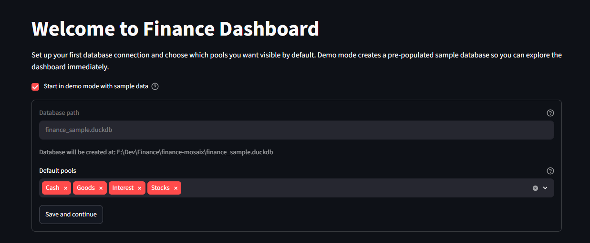
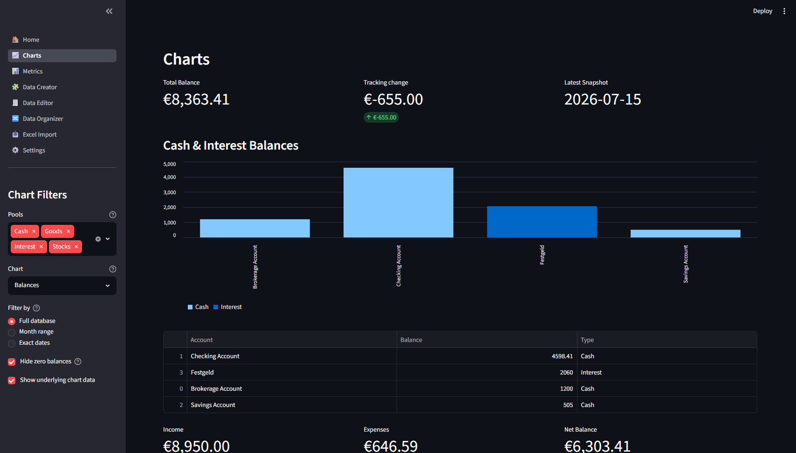
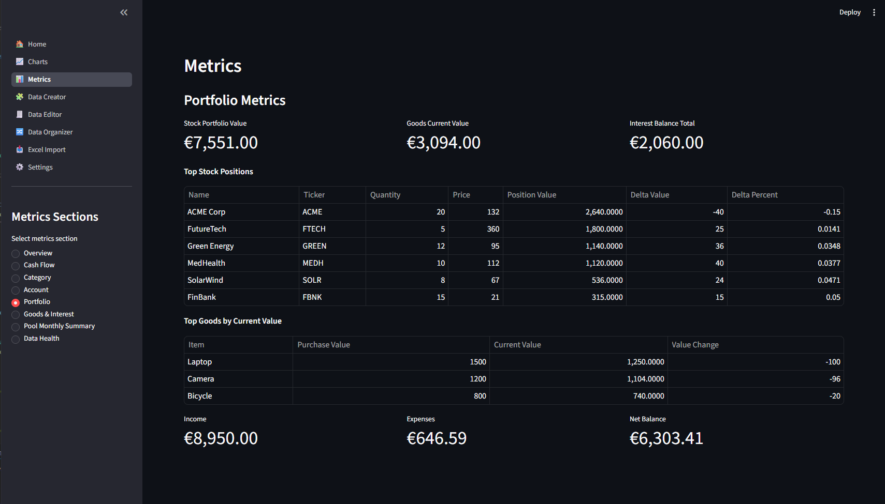
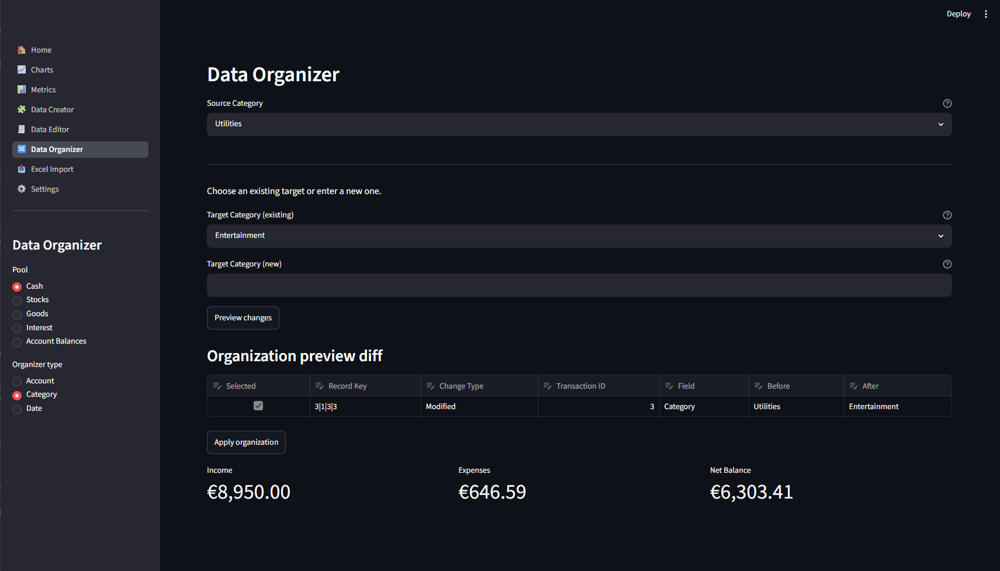
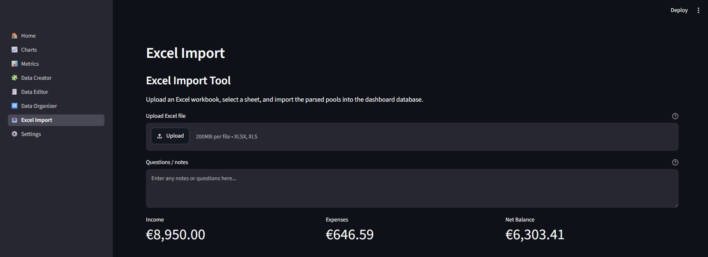
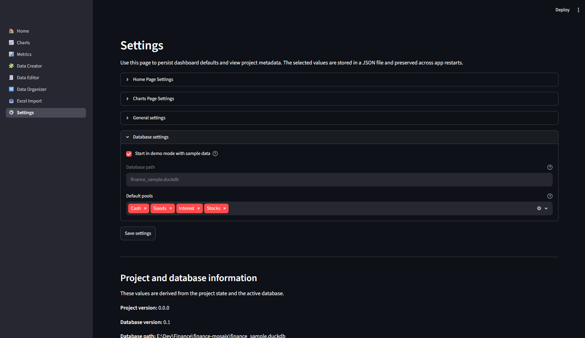

# Dashboard

The Finance mosaix dashboard is a Streamlit app for interactive financial analysis, reporting, and data management.

It uses the same DuckDB backend as the CLI, but the dashboard is optimized for exploring charts, reviewing account and portfolio metrics, and maintaining imported data.


## Start the dashboard

From the project root:

```bash
python start_dashboard.py
```

The local URL provided by Streamlit opens automatically in your browser.

## Dashboard pages

### Onboarding



The onboarding page helps you configure the initial dashboard connection and demo mode.

Key elements:
- demo mode toggle and sample data setup
- database path selection
- default dashboard pool selection
- save and continue flow

### Charts



The Charts page displays visual reports for cash flow, asset allocation, spending, account balances, and other selected pools.

Key elements:
- pool selection filters (Cash, Stocks, Goods, Interest)
- chart type selector
- date range controls

### Metrics



The Metrics page summarizes your data with metric cards and detailed tables.

Common sections:
- Overview Metrics
- Cash Flow Metrics
- Category Metrics
- Account Metrics
- Portfolio Metrics
- Goods & Interest Metrics
- Data Health Metrics

### Data Creator

Use this page to add or seed finance data directly in the dashboard.

### Data Editor

This page lets you view and edit raw pool data rows if your dashboard mode allows it.

### Data Organizer



The Data Organizer helps you clean and normalize imported data, fix balance snapshots, and merge or reorganize records.

### Excel Import



The Excel Import page guides you through uploading a workbook, selecting a sheet, and importing transaction data into DuckDB.

### Settings



The Settings page includes:
- database configuration
- demo mode
- chart options
- application mode
- notification preferences

## Recommended dashboard workflow

1. Start in demo mode or connect to your existing database.
2. Review the Home page to confirm the database date range and summary metrics.
3. Use Charts to explore cash flow, asset allocation, and spending categories.
4. Open Metrics for health checks and portfolio snapshots.
5. Use Data Organizer to clean or normalize imported data when needed.

For command-line operations, see [CLI Reference](cli.md).

## Dashboard vs CLI

The dashboard is best for interactive analysis, visualization, and guided maintenance tasks.
For automation, scripted imports, and terminal-first workflows, use the CLI.
